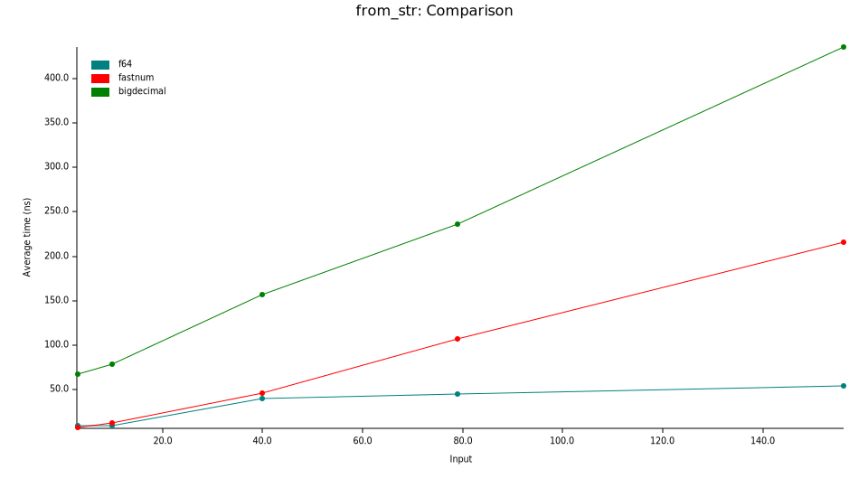
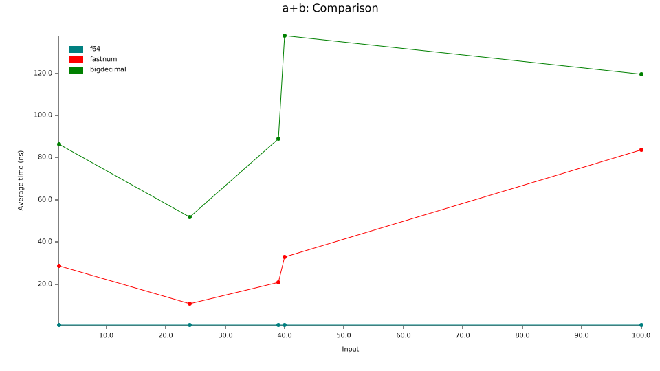
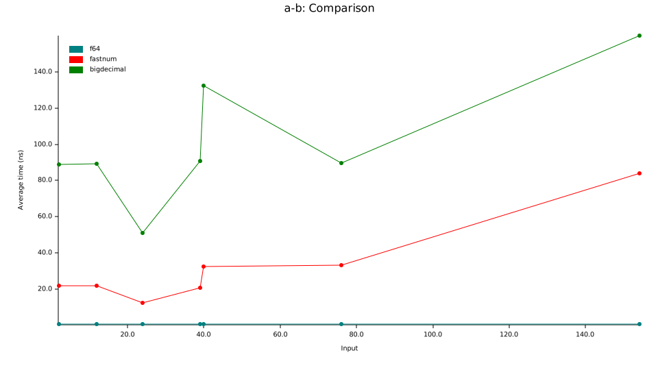
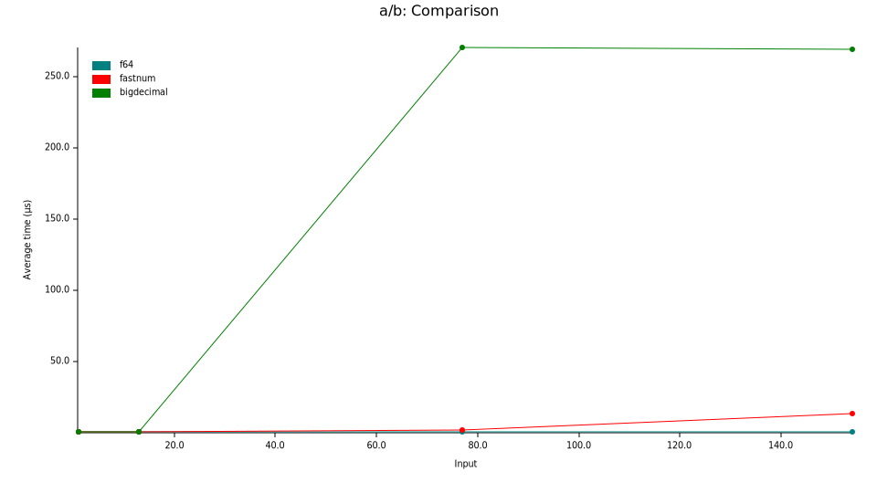

# fastnum

[](https://github.com/neogenie/fastnum)
[](https://crates.io/crates/fastnum)
[](https://crates.io/crates/fastnum)
[](https://docs.rs/fastnum/latest/fastnum)


Fixed-size decimal numbers implemented in pure Rust. Suitable for
financial, crypto and any other fixed-precision calculations.

[IEEE 754]: https://en.wikipedia.org/wiki/IEEE_754

[`D64`]: https://docs.rs/fastnum/latest/fastnum/decimal/type.D64.html

[`D128`]: https://docs.rs/fastnum/latest/fastnum/decimal/type.D128.html

[API Docs](https://docs.rs/fastnum/latest/fastnum)

## Overview

This crate is inspired by [num_bigint](https://docs.rs/num-bigint/0.4.6/num_bigint/)
and [bigdecimal](https://docs.rs/bigdecimal/latest/bigdecimal/) – amazing crates that allow you to store big
integers and arbitrary precision fixed-point decimal numbers almost any precision.

[BigInt](https://docs.rs/num-bigint/latest/num_bigint/struct.BigInt.html) internally uses a [
`Vec`](https://doc.rust-lang.org/std/vec/struct.Vec.html) of decimal digits
the size of which is theoretically limited only by the `usize` max value or memory capacity.

Under the hood [BigDecimal](https://docs.rs/bigdecimal/latest/bigdecimal/struct.BigDecimal.html) uses
a [BigInt](https://docs.rs/num-bigint/latest/num_bigint/struct.BigInt.html) object, paired with a 64-bit integer which
determines the position of the decimal point. Therefore, the precision is not actually arbitrary, but limited to 2<sup>
63</sup> decimal places.

Despite the seemingly undeniable advantages at first glance, this approach also has a number of fundamental
disadvantages:

- Non-copyable types for both integers and fixed point numbers.
- Dynamic allocation to store even tiny numbers, for example, `0` or `1`.
- Extra dynamic allocation for almost any operation (mathematical operations, parsing, converting, etc.).
- Constant calculations are not available.
- Potentially uncontrolled growth of memory consumption and the need to artificially limit it.

Because most practical problems requiring the use of fixed-point numbers do not require so much
limit on the number of digits, such as `usize`, but as a rule it is limited:

| Unit                              | Precision        | Decimal digits |
|-----------------------------------|------------------|----------------|
| United States Dollar (USD)        | 0.01             | 2              |
| United States Dollar, stock (USD) | 0.0001           | 4              |
| Bitcoin (BTC)                     | 10<sup>-8</sup>  | 8              |
| Ethereum (ETH)                    | 10<sup>-18</sup> | 18             |

Then most real numbers for financial and other systems requiring accuracy can use 256-bit or even 128-bit
integer to store decimal digits.

So In this library, a different approach was chosen.

### Decimals

`fastnum` provides signed and unsigned exact precision decimal numbers suitable for financial calculations that
require significant integral and fractional digits with no round-off errors (such as 0.1 + 0.2 ≠ 0.3).

Any `fastnum` decimal type consists of an N-bit big unsigned integer, paired with a 64-bit signaling block which
contains a 16-bit scaling factor determines the position of the decimal point, sign, special and signaling flags.
Trailing zeros are preserved and may be exposed when in string form.

Thus, fixed-point numbers are trivially copyable and don't require any dynamic allocation. This allows you to get
additional performance gains by eliminating not only dynamic allocation, like such, but also will get rid of one
indirect addressing, which improves cache-friendliness and reduces the CPU load.

## Why fastnum?

- **Strictly exact precision**: no round-off errors (such as 0.1 + 0.2 ≠ 0.3).
- **Special values**: `fastnum` support `±0`, `±Infinity` and `NaN` special values with [IEEE 754] semantic.
- **Blazing fast**: `fastnum` numerics are as fast as native types, well almost :).
- **Trivially copyable types**: all `fastnum` numerics are trivially copyable (both integer and decimal, ether signed
  and unsigned) and can be stored on the stack, as they're _fixed size_.
- **No dynamic allocation**: no expensive sys-call's, no indirect addressing, cache-friendly.
- **Compile-time integer and decimal parsing**: all the `from_*` methods on `fastnum` integers
  and decimals are `const`, which allows parsing of integers and numerics from string slices and floats at compile time.
  Additionally, the string to be parsed does not have to be a literal: it could, for example, be obtained via [
  `include_str!`](https://doc.rust-lang.org/core/macro.include_str.html), or [
  `env!`](https://doc.rust-lang.org/core/macro.env.html).
- **Const-evaluated in compile time macro-helpers**: any type has its own macro helper which can be used for
  definitions of constants or variables whose value is known in advance. This allows you to perform all the necessary
  checks at the compile time.
- **Short dependencies list by default**: `fastnum` depends only upon `bnum` by default.
  All other dependencies are optional.
  Support for crates such as [`rand`](https://docs.rs/rand/latest/rand/) and [
  `serde`](https://docs.rs/serde/latest/serde/) can be enabled with crate [features](#features).
- **`no-std` compatible**: `fastnum` can be used in `no_std` environments.
- **`const` evaluation**: nearly all methods defined on `fastnum` integers and decimals are `const`, which allows
  complex compile-time calculations and checks.
- **Full range of advanced mathematical functions**: exponential, roots, power, logarithmic, and trigonometric functions
  for working with exact precision decimals.
  And yes, they're all `const` too.

## Installation

To install and use `fastnum`, simply add the following line to your `Cargo.toml` file in the `[dependencies]` section:

```toml
fastnum = "0.3"
```

Or, to enable various `fastnum` features as well, add, for example, this line instead:

```toml
fastnum = { version = "0.3", features = ["serde"] } # enables the "serde" feature
```

## Example Usage

```rust
use fastnum::*;

fn main() {
    const ZERO: UD256 = udec256!(0);
    const ONE: UD256 = udec256!(1.0);

    let a = udec256!(12345);

    println!("a = {a}");
}
```

## Features

### Generic numeric `num_traits` trait implementations

The `numtraits` feature includes implementations of traits from the [
`num_traits`](https://docs.rs/num-traits/latest/num_traits/) crate, e.g. [
`AsPrimitive`](https://docs.rs/num-traits/latest/num_traits/cast/trait.AsPrimitive.html), [
`Signed`](https://docs.rs/num-traits/latest/num_traits/sign/trait.Signed.html), etc.

### Random Number Generation

The `rand` feature allows creation of random `fastnum` decimals via the [`rand`](https://docs.rs/rand/latest/rand/)
crate.

### Serialization and Deserialization

The `serde` feature enables serialization and deserialization of `fastnum` decimals via the [
`serde`](https://docs.rs/serde/latest/serde/) crate. More details about serialization and deserialization you can found
in

### Zeroize

The `zeroize` feature enables the [`Zeroize`](https://docs.rs/zeroize/latest/zeroize/trait.Zeroize.html) trait from
the [`zeroize`](https://docs.rs/zeroize/latest/zeroize/) crate.

### Database ORM's support

The `diesel` feature enables serialization and deserialization of `fastnum` decimals for [
`diesel`](https://docs.rs/diesel/latest/diesel/) crate.

The `sqlx` feature enables serialization and deserialization of `fastnum` decimals for [
`sqlx`](https://docs.rs/sqlx/latest/sqlx/) crate.

The `tokio-postgres` feature enables serialization and deserialization of `fastnum` decimals for [
`tokio-postgres`](https://docs.rs/tokio-postgres/latest/tokio_postgres/) crate.

### Autodocs crates support

The `utoipa` feature enables support of `fastnum` decimals for autogenerated OpenAPI documentation via the [
`utoipa`](https://docs.rs/utoipa/latest/utoipa/) crate.

## Competition & benchmarks

[`f64`]: https://doc.rust-lang.org/std/primitive.f64.html

[`fastnum`]: https://docs.rs/fastnum/latest/fastnum/

[`bigdecimal`]: https://docs.rs/bigdecimal/latest/bigdecimal/

[`rust_decimal`]: https://docs.rs/rust_decimal/latest/rust_decimal/

[`decimal_rs`]: https://docs.rs/decimal-rs/latest/decimal_rs/

[`Exceptional conditions`]: https://docs.rs/fastnum/latest/fastnum/#signaling-flags-and-trap-enablers

|                                                                          |  [`f64`]   |      [`fastnum`]      | [`bigdecimal`] | [`rust_decimal`] | [`decimal_rs`] |
|:------------------------------------------------------------------------:|:----------:|:---------------------:|:--------------:|:----------------:|:--------------:|
|                                Size, bits                                |   64(52)   |  64/128/256/512/...   |      any       |     128(96)      |       64       |
|                      Max precision, decimal digits                       |            | arbitrary<sup>*</sup> |   arbitrary    |        28        |       19       |
|                             Exact precision                              |            |           ✅           |       ✅        |        ✅         |       ✅        |
|                Trivially copyable / No dynamic allocation                |     ✅      |           ✅           |                |        ✅         |       ✅        |
| [`Exceptional conditions`] such as `inexact`, `subnormal`, `round`, etc. |            |           ✅           |                |                  |                |
|                `±0`, `±Infinity` and `NaN` special values                |     ✅      |           ✅           |                |                  |                |
|                        Compile-time calculations                         |     ✅      |           ✅           |                |                  |                |
|                               Performance                                | 🚀🚀🚀🚀🚀 |       🚀🚀🚀🚀        |       🚀       |     🚀🚀🚀🚀     |    🚀🚀🚀🚀    |
|                                 `no-std`                                 |     ✅      |           ✅           |       ✅        |                  |                |

<sup>*</sup> Precision is arbitrary but fixed.

[Benchmarks]: #competition--benchmarks

### Benchmarks

[Benchmarks]: #benchmarks

`fastnum` is blazing fast. As much as possible given the overhead of arbitrary precision support.

Some benchmark reports are shown below:

### Parse from string



| Decimal digits |   `f64`   | `fastnum` | `bigdecimal` |
|:--------------:|:---------:|:---------:|:------------:|
|       4        | 12.782 ns | 11.810 ns |  86.252 ns   |
|       11       | 12.759 ns | 17.175 ns |  92.105 ns   |
|       20       | 13.426 ns | 27.096 ns |  115.91 ns   |
|       22       | 38.531 ns | 30.746 ns |  127.37 ns   |
|       33       | 38.102 ns | 42.282 ns |  143.59 ns   |
|       39       | 38.295 ns | 48.973 ns |  151.37 ns   |
|       52       | 42.090 ns | 83.334 ns |  178.53 ns   |
|       72       | 42.856 ns | 112.30 ns |  215.94 ns   |

### Allocation


Allocate `vec![]` with `N` elements.

| `N`     |   `f64`   | `fastnum(D128)` | `bigdecimal` |
|---------|:---------:|:---------------:|:------------:|
| 100     | 62.099 ns |    59.355 ns    |  1.7866 µs   |
| 500     | 63.436 ns |    209.75 ns    |  8.7757 µs   |
| 1000    | 102.07 ns |    396.30 ns    |  17.402 µs   |
| 10000   | 769.01 ns |    4.2774 µs    |  178.33 µs   |
| 100000  | 10.777 µs |    43.982 µs    |  1.8032 ms   |
| 1000000 | 108.94 µs |    448.66 µs    |  18.395 ms   |

### Addition



Perform `a + b`.

| Decimal digits |   `f64`   | `fastnum` | `bigdecimal` |
|:--------------:|:---------:|:---------:|:------------:|
|       2        | 582.68 ps | 28.809 ns |  86.501 ns   |
|       24       | 536.08 ps | 10.890 ns |  51.743 ns   |
|       39       | 574.84 ps | 20.899 ns |  89.070 ns   |
|       40       | 562.10 ps | 32.838 ns |  137.64 ns   |
|      100       | 562.10 ps | 83.700 ns |  119.52 ns   |

### Subtraction



Perform `a - b`.

| Decimal digits |   `f64`   | `fastnum` | `bigdecimal` |
|:--------------:|:---------:|:---------:|:------------:|
|       2        | 654.78 ps | 21.761 ns |  89.013 ns   |
|       12       | 622.80 ps | 21.815 ns |  89.317 ns   |
|       24       | 526.57 ps | 12.354 ns |  51.006 ns   |
|       39       | 574.51 ps | 20.839 ns |  90.768 ns   |
|       40       | 557.47 ps | 32.524 ns |  132.43 ns   |
|       76       | 534.51 ps | 33.343 ns |  89.778 ns   |
|      154       | 622.19 ps | 83.844 ns |  159.80 ns   |

### Multiplication


Perform `a × b`.

| Decimal digits |   `f64`   | `fastnum` | `bigdecimal` |
|:--------------:|:---------:|:---------:|:------------:|
|       3        | 512.51 ps | 8.8683 ns |  57.996 ns   |
|       30       | 529.00 ps | 8.7431 ns |  56.618 ns   |
|       44       | 609.04 ps | 9.0473 ns |  106.84 ns   |
|       88       | 617.74 ps | 74.798 ns |  463.48 ns   |

### Division



Perform `a ÷ b`.

| Decimal digits |   `f64`   | `fastnum` | `bigdecimal` |
|:--------------:|:---------:|:---------:|:------------:|
|       1        | 554.17 ps | 12.181 ns |  96.252 ns   |
|       13       | 607.92 ps | 84.582 ns |  175.94 ns   |
|       77       | 592.75 ps | 1.8675 µs |  270.37 µs   |
|      154       | 572.60 ps | 13.297 µs |  269.63 µs   |

### To f64 conversion


Convert [`D64`]/[`D128`] decimals into `f64` floating point.

| Decimal digits | `rust_decimal` | `fastnum 64` | `fastnum 128` | `bigdecimal`<sup>*</sup> |
|:--------------:|:--------------:|:------------:|:-------------:|:------------------------:|
|       1        |   3.4253 ns    |  2.0280 ns   |   3.6434 ns   |        3.0061 ns         |
|       3        |   13.245 ns    |  2.0127 ns   |   3.6692 ns   |        95.600 ns         |
|       4        |   11.196 ns    |  2.1009 ns   |   3.8226 ns   |        97.964 ns         |
|       5        |   14.461 ns    |  2.1014 ns   |   3.8178 ns   |        94.742 ns         |
|       7        |   14.623 ns    |  2.0128 ns   |   3.6693 ns   |        114.97 ns         |
|       8        |   15.449 ns    |  2.0143 ns   |   3.6702 ns   |        95.565 ns         |
|       11       |   16.038 ns    |  2.1010 ns   |   3.8171 ns   |        111.85 ns         |
|       17       |   16.724 ns    |  2.0124 ns   |   3.6694 ns   |        117.51 ns         |
|       20       |   17.735 ns    |  4.7012 ns   |   6.1908 ns   |        133.63 ns         |
|       21       |   17.765 ns    |  4.7811 ns   |   6.0507 ns   |        136.35 ns         |
|       33       |   105.09 ns    |      -       |   25.651 ns   |        271.66 ns         |
|       36       |   104.97 ns    |      -       |   25.838 ns   |        271.89 ns         |
|       41       |       -        |      -       |   44.526 ns   |        368.55 ns         |

-

<sup>*</sup> `bigdecimal` to float conversion is not pretty accurate.

You can run benchmark tests with [`Criterion.rs`](https://bheisler.github.io/criterion.rs/book/criterion_rs.html) tool:

```shell
cd benchmark
cargo criterion
```

## Testing

This crate is tested as well as with specific edge cases.

```shell
cargo test --all-features
```

## Minimum Supported Rust Version

The current Minimum Supported Rust Version (MSRV) is `1.87.0`.

## Documentation

[API Docs](https://docs.rs/fastnum/latest/fastnum)

**NB**: `fastnum` is currently pre-`1.0.0`. As per
the [Semantic Versioning guidelines](https://semver.org/#spec-item-4),
the public API may contain breaking changes while it is in this stage. However, as the API is designed to be as similar
as possible to the API of Rust's primitive types, it is unlikely that there will be a large number of breaking
changes.

## Compile-Time Configuration

You can set a few default parameters at _compile-time_ via environment variables:

| Environment Variable                           | Default  |
|------------------------------------------------|----------|
| `RUST_FASTNUM_DEFAULT_ROUNDING_MODE`           | `HalfUp` |
| `RUST_FASTNUM_FMT_EXPONENTIAL_LOWER_THRESHOLD` | 5        |
| `RUST_FASTNUM_FMT_EXPONENTIAL_UPPER_THRESHOLD` | 15       |
| `RUST_FASTNUM_FMT_MAX_INTEGER_PADDING`         | 1000     |
| `RUST_FASTNUM_SERDE_DESERIALIZE_MODE`          | `Strict` |

## Future Work

There are several areas for further work:

- Micro-optimization of big integer types using vector extensions (SSE2, SSE4.2, AVX2, AVX512F, etc.).
- Const trait implementations once they're stabilized in Rust. (https://github.com/rust-lang/rust/issues/67792)
- Integration with a large number of crates (ORM's, auto-docs crates, etc.).

## Licensing

This code is dual-licensed under the permissive
[MIT](https://opensource.org/licenses/MIT) &
[Apache 2.0](https://opensource.org/licenses/Apache-2.0) licenses.

## Contribution

Unless you explicitly state otherwise, any contribution intentionally
submitted for inclusion in the work by you, as defined in the
Apache-2.0 license, shall be dual licensed as above, without any
additional terms or conditions.

## Changelog

[view changelog](CHANGES.md)

